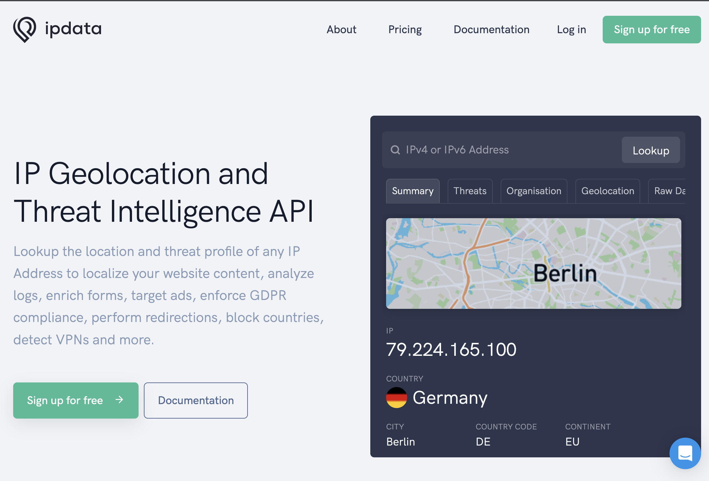
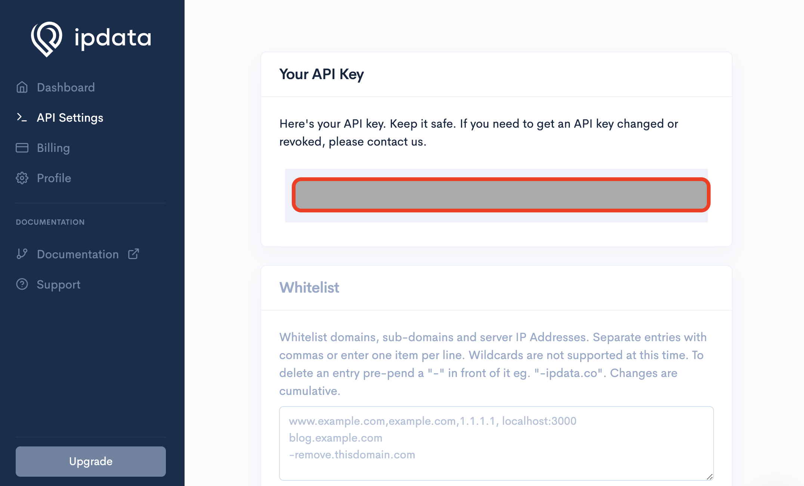

# Python program to convert ip address to location

## About
This Python program uses the [ipdata Python library](https://pypi.org/project/ipdata/) to retrieve the following location details for an IP Address. The output is: 
* Country
* City
* State
* Country Code
* Continent

## Download ipdata library 
```pip install ipdata```

## Obtain API key
1. Visit [the ipdata website](https://www.ipdata.co) and sign up for an account if you already do not have one.



2. Go to the API Setting menu on the left  to obtain your assigned API Key. See screenshot below



## Program Execution
Format: ```python3 ip2location.py [API Key] [IP Address]```

Input: ```python3 ip2location.py [API Key] 45.222.18.10```

Result: 
```
Country: South Africa
City: Johannesburg
State: Gauteng
Country Code: ZA
Continent: Africa
```


